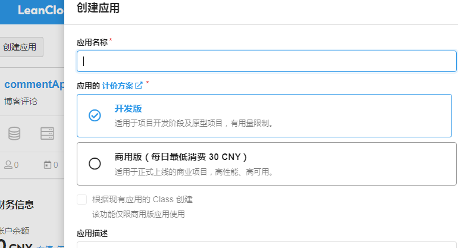
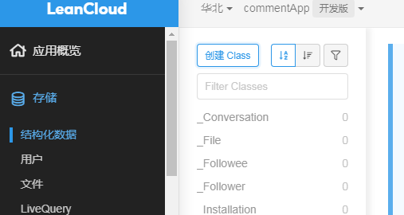
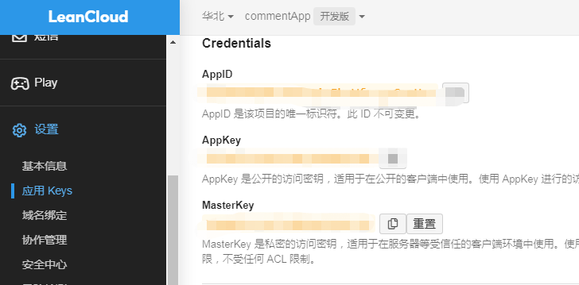
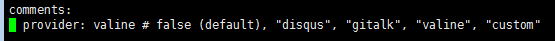
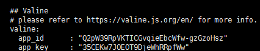
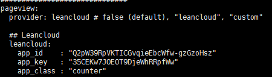

---

title: blog添加评论和计数功能

author: evod

tags: blog  comment count

key: add_comment_count

---
	评论功能系统我用的是Valine，因为Valine可以和计数功能可以和共用一个 LeanCloud 应用作为后台服务支持。大致流程分为两步： 一是注册一个 LeanCloud 账号，然后建立一个 LeanCloud 应用，在leanCloud用中创建class，因为 Valine 启用后会自动在应用中建立一个 Class，所以只需手动创建一个class； 二是获取相应LeanCloud应用的APP ID 和 APP KEY，修改配置文件即可。


### step1

	注册流程略过，首先创建LeanCloud 应用，计价方案选开发版，免费

	创建完成后进入应用配置页面，点击存储，结构化数据，创建class，ACL权限选择无限制



### step2

	还是在应用配置页面，点击配置，应用keys，查看APP ID 和 APP KEY

#### 评论功能配置

	修改_config.yml的以下字段,app_id和app_key即上图中的相关信息





#### 浏览计数功能配置

	修改_config.yml的以下字段，app_id和app_key同上，app_class为step1创建的class名称



<br/>

此外还需YAML 头信息中添加key属性

```
key：(页面的唯一标识符，供评论系统和点击量统计使用。必须以字母（[A-Za-z]）开头，
      其后可以接若干字母、数字（[0-9]）、连字符（-）、下划线（_）、冒号（:）和
      小数点（.）)
```
